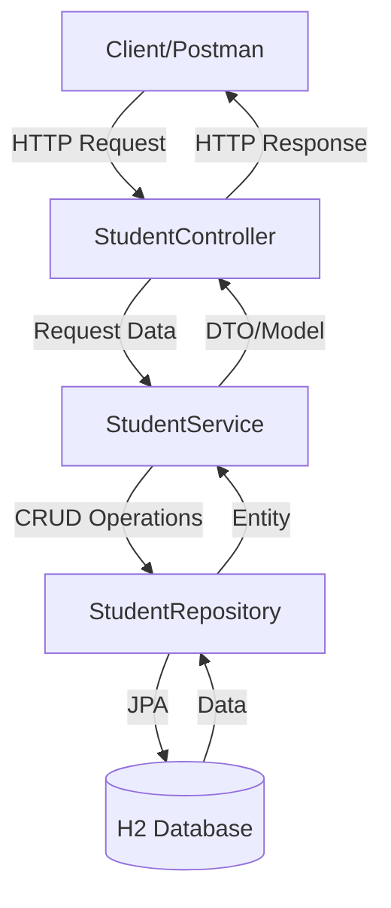

# Spring Boot Architecture Flow

## Components:
1. **Controller Layer** (StudentController.java)
   - Handles HTTP requests and responses
   - Maps URLs to specific methods
   - Validates input data

2. **Service Layer** (StudentService.java)
   - Contains business logic
   - Processes data
   - Calls repository methods

3. **Repository Layer** (StudentRepository.java)
   - Communicates with database
   - Performs CRUD operations
   - Uses Spring Data JPA

4. **Model Layer** (Student.java)
   - Defines data structure
   - Contains validation rules
   - Maps to database tables

5. **Database** (H2 In-Memory Database)
   - Stores application data
   - Accessible via H2 console
